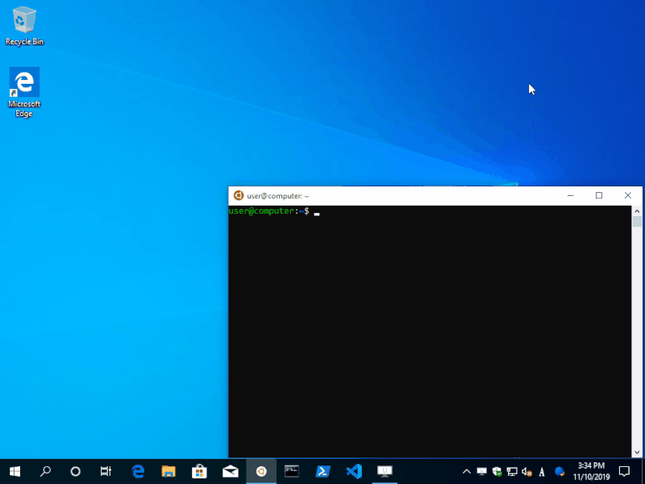

# eopen-ecd

eopen: Open Explorer from Terminal.<br>
ecd: Change directory of Terminal and Explorer at once.



## Supported Windows, Terminals

### Windows

  * *Windows 10 64bit 1903* or later recommended (`\\wsl$\` path is supported)
  * At least *Windows 10 64bit 1803* is required for WSL (`wslpath` required)
  * Probably works on *Windows 7* (includes 32bit) or later
    * Of course, *PowerShell* and *Command Prompt* only

### Terminals

  * `WSL` / `WSL2` recommended for the terminal
    * Works on `bash`, `zsh`, `ksh`, `mksh`, `yash`, `tcsh`, `fish`
  * Semi-support for *PowerShell* and *Command Prompt*

## Usage

### Available commands

|                | eopen | eclose |  ewd  |  ecd  | epushd | epopd | elsi  |
| -------------- | :---: | :----: | :---: | :---: | :----: | :---: | :---: |
| WSL            |   o   |   o    |   o   |   o   |   o    |   o   |   o   |
| PowerShell     |   -   |   -    |   o   |   o   |   o    |   o   |   o   |
| Command Prompt |   -   |   -    |   o   |   o   |   o    |   o   |   o   |

**Note** Currently, `eopen` and `eclose` are not implemented for
PowerShell / Command Prompt. Use `explorer.exe` instead.

### eopen

`Usage: eopen [ -e | --editor ] [ -s | --search ] [ -n | --new ] [ --sudo ] [ -g | --background ] [ -v | --version ] [ -h | --help ]`

* Open the directory with Explorer from the Terminal.
* Open the file with application from the Terminal.

#### Examples

```
# Open directory with (latest used) Explorer
eopen ~/.config/

# Open directory with new instance of Explorer
eopen -n ~/.config/

# Opens with Windows default application
eopen image.png

# Opens with Windows text editor
eopen -e ~/.bashrc

# Use sudo to edit the unowned file
eopen -e --sudo /etc/hosts

# Opens with Windows default browser
eopen http://google.com

# Search with Windows default browser
eopen -s "eopen-ecd"

# Open files and directories under Windows
eopen C:/Windows

# Open files and directories under Network shared folder
eopen //server/shared

# Others
eopen mailto:user@example.com   # Mail protocol
eopen calculator:               # Application
eopen shell:Personal            # Shell commands
eopen :MyComputerFolder         # Shorthand for shell:
eopen shell:::{2559a1f8-21d7-11d4-bdaf-00c04f60b9f0} # CLSID
eopen :                         # Current Explorer location
eopen :/workspace               # Relative path from current Explorer location
```

#### Environemnt variables

| name              | description                             | default                              |
| ----------------- | --------------------------------------- | ------------------------------------ |
| `EOPEN_EDITOR`    | Execution path of editor for `eopen -e` | `notepad.exe`                        |
| `EOPEN_SEARCH`    | Search engine for `eopen -s`            | `https://www.google.com/search?q=%s` |
| `EOPEN_LAUNCH_TO` | Default location for new explorer       | Windows settings                     |

**Note** Set environment variables on Windows (not in WSL).

**Hint** `EOPEN_LAUNCH_TO` accepts *Shell: commands* and *CLSID* not only Windows path.

### eclose

`Usage: eclose`

Close the (lastest used) Explorer.

### ewd

`Usage: ewd [ -u | --unix ] [ -w | --windows ] [ -m | --mixed ]`

Display path of the (latest used) Explorer location.

### ecd

`Usage: ecd <directory>`

Change the directory of Terminal and Explorer at once.

If first charactor of path is `:`, it means relative path from current
Explorer location.

#### Examples

```
# Change the directory to the '/etc'. (Both Terminal and Explorer)
ecd /etc

# Change the directory to the 'C:\Windows'. (Both Terminal and Explorer)
ecd c:/windows

# Change the directory to the current Explorer location.
ecd :

# Change the directory to the 'workspace' from current Explorer location.
ecd :/workspace

# Change the directory to the home directory.
ecd

# Change the directory to the Windows home (%USERPROFILE%) directory. (WSL only)
ecd ~~

# Change the directory to the ~~ directory instead Windows home directory.
ecd ./~~
```

### epushd / popd

`Usage: epushd <directory>` <br>
`Usage: epopd`

Push or pop a directory to the directory stack stack, And Change the directory
of Terminal and Explorer at once. (Use `push` instead of `cd`.)

**Note** Not available on `ksh` and `mksh`, since `push` and `pop` are not implemented.

### elsi

`Usage: elsi [ -u | --unix ] [ -w | --windows ] [ -m | --mixed ] [ -0 | --null]`

List selected items of the Explorer.

## Download

**Download from [releases page](https://github.com/ko1nksm/eopen/releases)**

**Note** Highly recommend using x64 binary on Windows 10 64bit edition.
x86 binary is also work, but access to the WSL path (`\\wsl$\...`) from
32bit process is unstable. (Related? [issue 4260][4260] of microsoft/WSL)

[4260]: https://github.com/microsoft/WSL/issues/4260

**Note** It is also distributed for Windows 10 ARM / ARM64.
But I do not have those platforms. So it has not been tested at all.

## Installation

Extract the zip file to any directory and set to your shell's profile.

**Note** Require to enable `Launch folder windows in a separete process` in
*Explorer* -> *File* -> *Change folder and search options* -> *View*
-> *Advanced settings*.

### WSL terminal / Cygwin / MSYS2 / Git for Windows

Change the following line to the appropriate path and add it to your
shell's profile under your home directory.

#### For POSIX compliant shells

```sh
eval "$(sh "/path/to/eopen-ecd/init.sh")"
```

[Profile] **bash:** `.bashrc`, **zsh:** `.zshrc`, **ksh:** `.kshrc`,
**mksh:**, `.mkshrc`, **yash:** `.yashrc`

#### For tcsh

```sh
eval `sh "/path/to/eopen-ecd/init.sh" tcsh`
```

[Profile] **tcsh:** `.tcshrc`

#### For fish

```sh
eval (sh "/path/to/eopen-ecd/init.sh" fish)
```

[Profile] **fish:** `.config/fish/config.fish`

### PowerShell

Change the following line to the appropriate path and add it to your
PowerShell's profile.

```powershell
. "/path/to/eopen-ecd/init.ps1"
```

To edit profile, type `notepad $PROFILE` in PowerShell.


**Note** Require to change PowerShell execution policy.
(Google `Set-ExecutionPolicy`).

### Command prompt

Change the following line to the appropriate path and add it to `profile.bat`
(or favorite name)

```batch
@call \path\to\eopen-ecd\init.bat
```

Load it to Command Prompt. (For example, use `cmd /k profile.bat`)

## For developers

### Architecture

The `ebridge.exe` is helper module that operate shell (Explorer) via
COM Automation. All scripts are thin frontend of the `ebridge.exe`.

### How to build ebridge.exe

Require to install [Visual Studio 2019][vs2019] to build.
(Free Community Edition is enough.)

[vs2019]: https://visualstudio.microsoft.com/downloads/

To build, the following steps after installation of Visual Studio 2019

1. Run `Developer Command Prompt for VS 2019` from the *start menu*
2. Goto project root directory
3. Run `build.bat <TARGET...>` (TARGET: `x86`, `x64`, `arm`, `arm64`)
4. Generate archive files to the `dist` directory.

Or double click `ebridge.sln` in the [src](src) directory to launch Visual Studio IDE.

### Test

None, should be do.

## History

The formerly name of this project was `ecd` that was started to port
the `fcd` for macOS to Windows.

  * [fcd](http://www.script-factory.net/software/terminal/fcd/index.html) - Script factory
  * [fcd](https://qiita.com/Yuhsak/items/a1f154f14e5ff871b6d2) - another one-liner version

The core module was written with PowerShell script. Early version of
`ecd` and `eopen` were relies on the script. It was a bit slow (about 400ms-).
So I rewrote the core module as native by VC++.
And `eopen`, which has many features, has been changed to the main.

[CHANGELOG](CHANGELOG.md)

## License

MIT License
